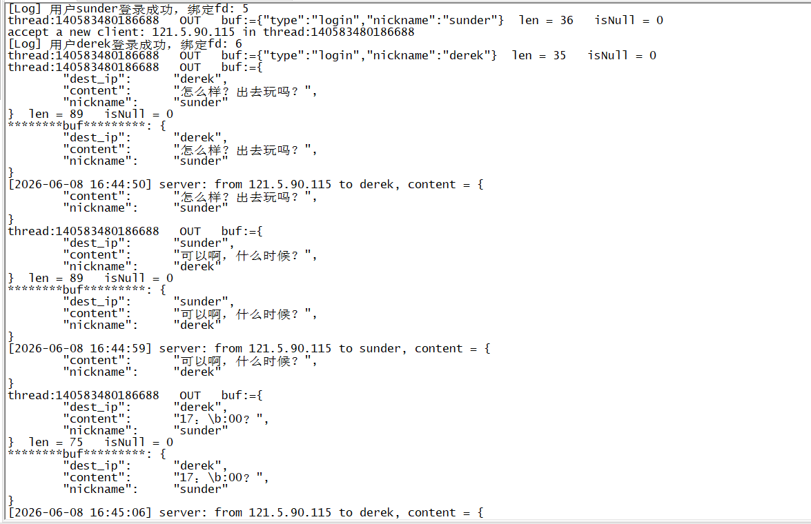
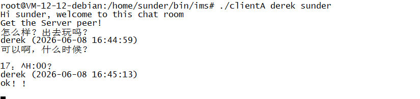
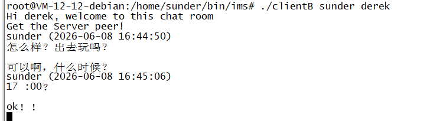

    <a href="./README_CN.md">中文</a>

## Sunder ims
an IMS module in Linux(based on epoll), it's combined with server module and client module(such as Wechat, QQ etc)

## how to use it

* compile the C code:
    *  gcc -o server_epoll server_epoll.c cJSON.c -lpthread -lgdbm
    *  gcc -o clientA clientA.c cJSON.c -lpthread
    
    
* run the exec file
    * ./server_epoll 
    

		
	

    
    * ./clientA [your friend nickname] [your nickname](./clientA derek sunder)
    

		
	

	
    * ./clientB [[your friend nickname] [your nickname](./clientB sunder derek)
    

		
	

	
	
* now clientA can chat with clientB through the server

* thanks for the project [cJSON](https://github.com/DaveGamble/cJSON)